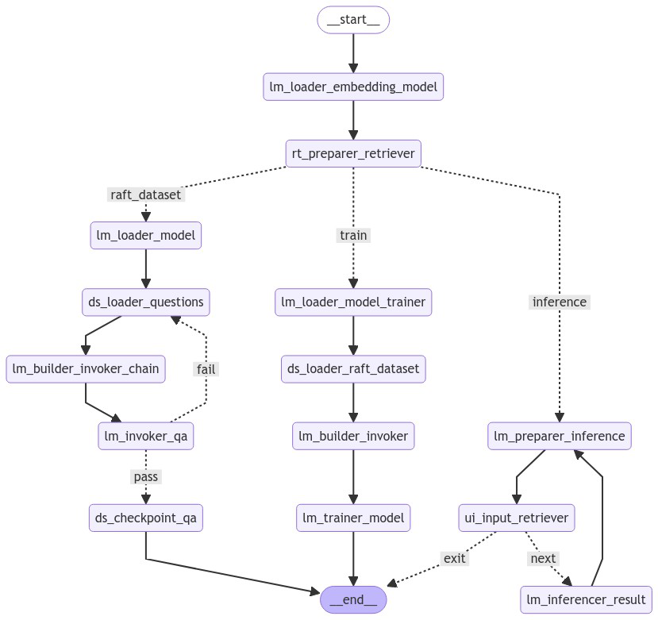

# DQChat

[](https://pixi.sh)

> [!NOTE]
> We are making huge refactoring to package structure. Please refer to [GitHub Issues](https://github.com/junnoslab/DQChat-langGraph/issues) for progress.

## Flow Chart



## Getting started

### Install [`pixi`](https://pixi.sh/latest/)

We use [`pixi`](https://pixi.sh/latest/) for package management tool.\
You can install pixi with simple scripts below.

```shell
# With official shell script
curl -fsSL https://pixi.sh/install.sh | bash

# Simply using Homebrew
brew install pixi
```

### Available Tasks

> [!Warning]
> Following commands are set up for my personal use. (which means they usually requires personal access tokens inside `utils/secret.py` file.\
> Passing arguments using pixi commands will be added in the future.
> 
> Otherwise, you can just simply use `python -m dqchat [options]` command format while the pixi subshell is activated. You can check available subcommands with `python -m dqchat --help`.

#### (Optional) Activate pixi subshell

Before running any tasks, activate the pixi-managed virtual python environment.

```shell
pixi shell
```

This command enables python virtual environment, ensuring all commands to use correct dependencies via pixi subshell.

#### 1. Generate RAFT Dataset

To create dataset for RAFT fine-tuning:

```shell
# Generate RAFT dataset by downloading prompt dataset from 🤗 HuggingFace.
pixi r gd
# Generate RAFT dataset using cached prompt dataset. (for H100 session)
pixi r gdc
```

Use one of these commands to prepare dataset used for fine-tuning your preferred LLM model.

#### 2. Run RAFT Fine-Tuning

```shell
# Run Fine-Tuning by downloading RAFT dataset from 🤗 HuggingFace.
pixi r t
# Run Fine-Tuning by using cached dataset. (for H100 session)
pixi r tc
```

#### 3. Inference mode (🚧 WIP)

```shell
pixi r r
```
